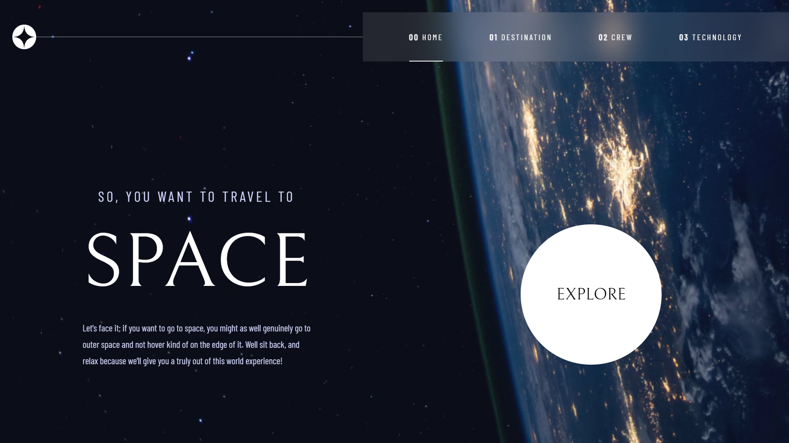
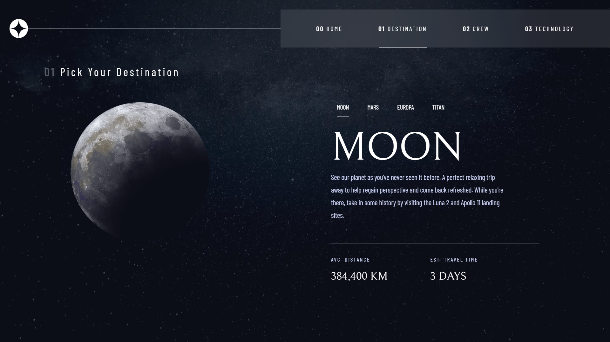
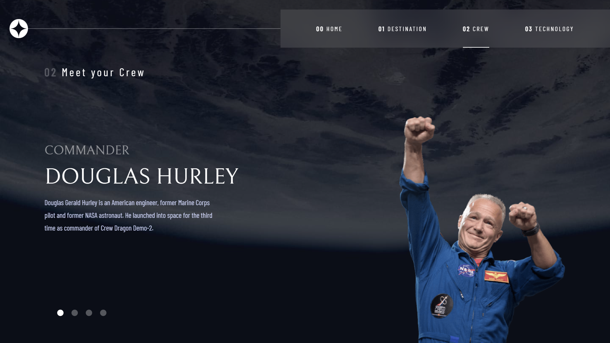
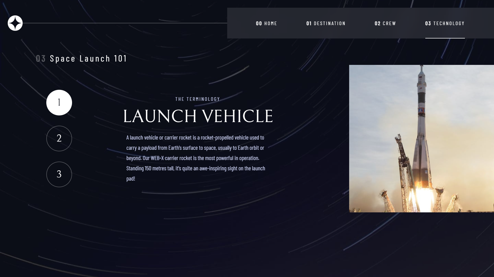

# Space Tourism Website ✨🌠

Hey there! 👋 Welcome to my Space Tourism Website—a little passion project where I dive into the cosmos, showcasing potential space destinations, introducing the fantastic crew members behind the scenes, and geeking out about the technology that propels us into the final frontier.

## Table of Contents

- [Overview](#overview)
  - [Introduction](#introduction)
  - [Screenshots](#screenshots)
  - [Links](#links)
- [Project Details](#project-details)
  - [Development Information](#development-information)
  - [Learning Outcomes](#learning-outcomes)
- [Author](#author)

## Overview 

### Introduction 🌟

Embark on a virtual journey to outer space with our Space Tourism Website. This project aims to provide a comprehensive experience for users interested in space exploration. Discover exciting destinations, meet the crew members who make space travel possible, and explore the advanced technology that drives our space missions.

### Screenshots

#### Home Page 🌎

#### Destination Page 🪐

#### Crew Page 👨‍🚀

#### Technology Page 🛰

### Links 🔗

- [Code 👩‍💻](https://github.com/shk-ubd/space-tourism)
- [Explore the Space Tourism Website 🚀](https://shk-ubd-space-tourism.netlify.app)

## Project Details - Crafting the Cosmos 🌌

### Development Information

- **Frontend Framework:**
  - The project is exclusively a frontend website developed using React.
  - Tailwind CSS is utilized for styling, showcasing proficiency in this utility-first CSS framework.

- **Project Structure:**
  - Developed with Vite, the project features separate components for different pages, including Home, Destination, Crew, Technology, and a Navbar.
  - While no custom structure was followed, the use of components for different pages enhances modularity.

- **Responsive Design:**
  - Ensured a responsive design using Tailwind CSS, demonstrating the ability to create visually appealing and adaptable interfaces.

- **Data Handling:**
  - Utilized a `data.json` file within the project for data management.
  - Context API in React was employed to store and share data across various components seamlessly.

### Learning Outcomes

- **Frontend Technologies:**
  - Enhanced proficiency in React, showcasing skills in building dynamic and interactive user interfaces.
  - Gained mastery in using Tailwind CSS for efficient and utility-driven styling.

- **Context API and React Router:**
  - Demonstrated understanding and application of React Context API for effective state management across components.
  - Successfully implemented React Router for seamless navigation between different pages.

### Author

- Github - [@shk-ubd](https://github.com/shk-ubd)
- LinkedIn - [Sheikh Ubaid Ullah](https://www.linkedin.com/in/sheikh-ubaid/)

## Conclusion

This project, built using React and Tailwind CSS, highlights proficiency in frontend technologies. The utilization of Vite for project setup, coupled with the effective use of React Router and Context API, reflects a solid grasp of modern frontend development practices. The responsive design ensures a seamless user experience across devices. As a learning project, it serves as a testament to the developer's growth in both React and Tailwind CSS, with practical application and hands-on experience.
